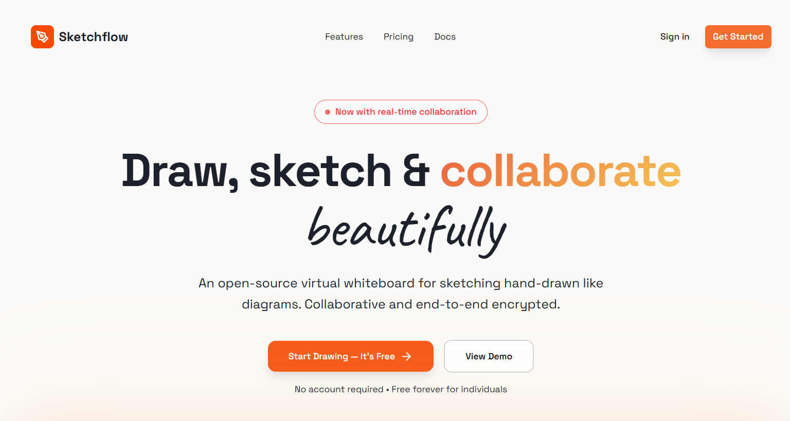
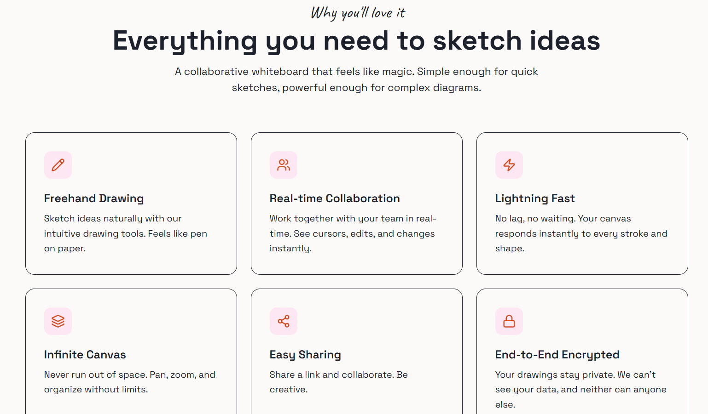
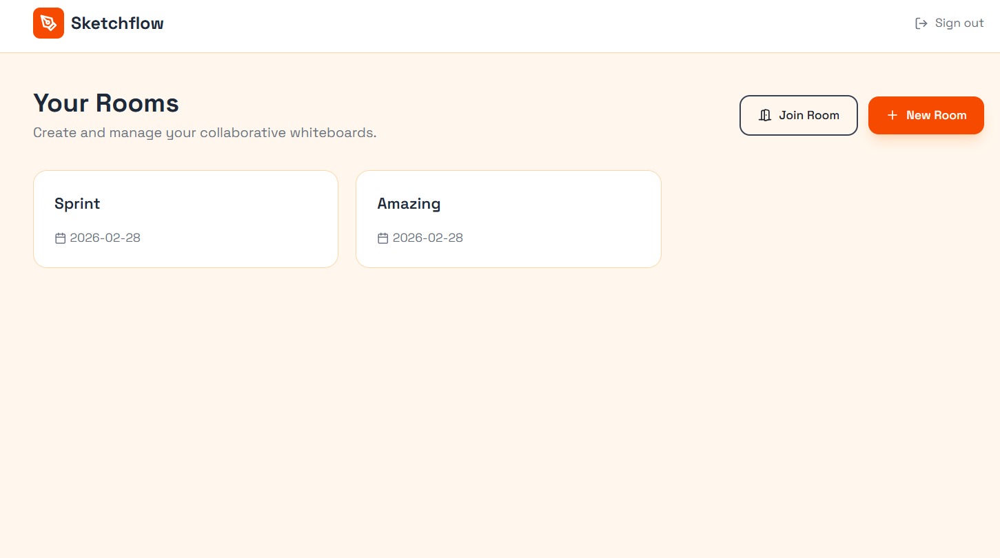

# 🎨 SketchFlow

SketchFlow is a modern **collaborative whiteboard web application** that enables users to draw, interact, and share ideas in real time on an infinite canvas.

Designed with performance and scalability in mind, it combines a smooth drawing experience with a structured full-stack architecture.

---

## 🚀 Live Demo

👉 [*(Test here)*](https://sketchflowdev.netlify.app/)

> ⚠️ Note: Backend is hosted on a free tier, so the first request may take a few seconds due to cold start.
> ✅ No signup/login required — you can try the app instantly.

  
      
---

## ✨ Features

### 🖌️ Drawing & Canvas

* Freehand drawing for smooth sketching
* Shape tools:

  * Rectangle
  * Circle
  * Line
  * Diamond
* Infinite canvas with **panning and zooming support**

### 🧠 Editing

* Undo / Redo functionality

### 🤝 Collaboration

* Share and invite users *(real-time capabilities via WebSockets)*

### 📱 Responsive UI

* Optimized for desktop and tablet experiences

---
## ⚡ Quick Access

No authentication required — simply open the app and start drawing immediately.

---

## 🛠️ Tech Stack

### Frontend

* **Next.js (TypeScript)**
* **Canvas API** for rendering and interactions

### Backend

* **Node.js (TypeScript)**
* **WebSocket (ws)** for real-time communication
* **HTTP server (REST APIs)**
* Authentication & security:

  * JWT
  * bcrypt
  * CORS

### Architecture

* **Turborepo** for monorepo management

---

## 📂 Project Structure

```
apps/
├── sketchflow-fe     # Frontend (Next.js)
├── http-server       # REST API server
└── ws-server         # WebSocket server
```

---

## ⚙️ Getting Started

### 1. Clone the repository

```bash
git clone https://github.com/rafia-codes/SketchFlow.git
cd SketchFlow
```

### 2. Install dependencies

```bash
npm install
```

### 3. Run the project

#### ▶️ Frontend

```bash
cd apps/sketchflow-fe
npm run dev
```

Runs on: **http://localhost:3000**

#### ▶️ HTTP Server

```bash
cd apps/http-server
npm run dev
```

Runs on: **http://localhost:3001**

#### ▶️ WebSocket Server

```bash
cd apps/ws-server
npm run dev
```

Runs on: **ws://localhost:8080**

---

## 🧩 Future Improvements

* Advanced real-time collaboration (multi-user cursors, presence)
* Layers & object selection system
* New features
* Performance optimizations for large canvases

---

## 💡 Key Highlights

* Implemented **infinite canvas with pan & zoom mechanics**
* Designed a **separate WebSocket server** for scalable real-time communication
* Structured using **monorepo architecture (Turborepo)**
* Built with **TypeScript across the stack** for maintainability

---

## 🤝 Contributing

Contributions are welcome!

1. Fork the repository
2. Create a feature branch
3. Submit a pull request

---

## 📄 License

This project is licensed under the MIT License.

---

## 👩‍💻 Author

**Rafia**
GitHub: https://github.com/rafia-codes

---

## ⭐ Support

If you find this project useful, consider giving it a ⭐ on GitHub!
